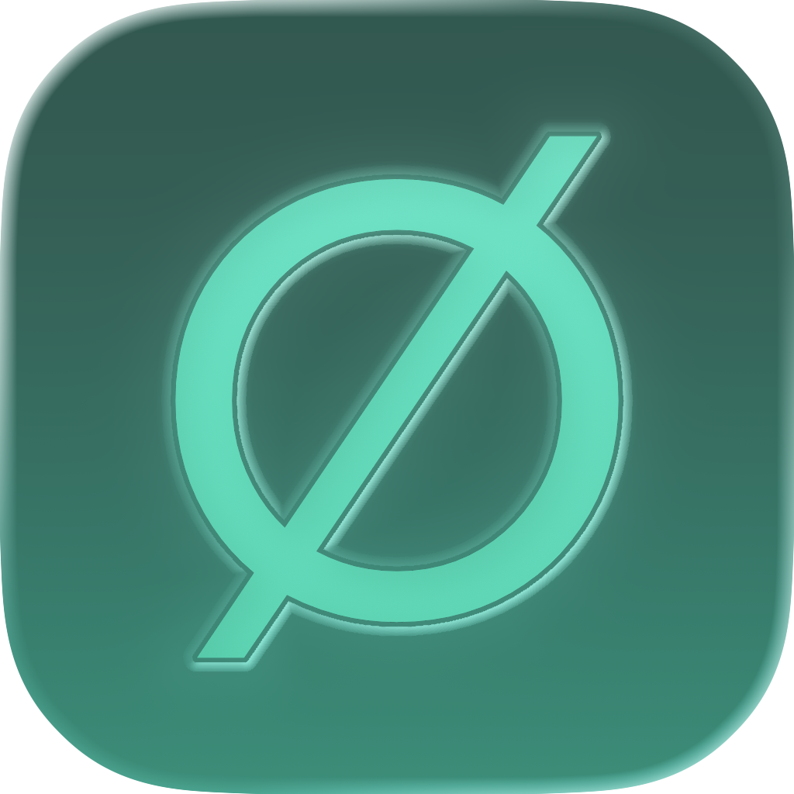

<p align="center">
  
</p>

<h1 align="center">Origami</h1>

<p align="center">The open-source browser for Mac, built for the AI era.</p>

Origami is a native macOS browser built with Swift, SwiftUI, and WebKit. It brings everyday browsing and optional AI-powered information tools into one Mac app.

**AI-native, never AI-required.** Ordinary browsing works without an AI provider or API key. Origami includes no first-party telemetry.

## Browse your way

- **Horizontal or vertical tabs**, with Peek previews, two-pane Split View, and Reader for focused reading.
- **Profiles and Private Browsing**, alongside native History, Bookmarks, and Downloads.
- **Customization** for appearance, accent colors, tab density, and the New Tab page.
- **Ask the Web**, plus page and selection questions, comparison, and citation tools when you choose to use AI.

## Ask the Web

Ask the Web is a search-first information interface with Ask, Research, and Reference modes. Answers use structured blocks and source references rendered natively. Optional interactive Generated Visuals run in an isolated WebKit view; they supplement the answer rather than replace it.

Bring your own key for **OpenAI, OpenRouter, Gemini, or xAI**, and choose your models in Settings → AI. Credentials are stored in macOS Keychain. Provider/model capabilities vary, and model usage or web search may incur charges. Requests go to your chosen provider; its privacy and retention policies apply.

Private Ask the Web answers are not saved in local history. Private Browsing is not anonymity: websites and providers still receive requests, and explicitly saved bookmarks and downloaded files remain.

## Status and requirements

Origami is **Beta / pre-release software**. Expect rough edges and changing behavior; there is no published release download linked here yet.

- **macOS 15.4 or later** to run.
- **Xcode 26.5** is the currently verified build toolchain. Newer macOS visual effects use availability checks.

## Build from source

Clone the repository (GitHub access is required while it is private):

```sh
git clone https://github.com/T-1234567890/origami-browser.git
cd origami-browser
open Origami.xcodeproj
```

Let Swift Package Manager resolve dependencies, select the **Origami** scheme and **My Mac**, then build and run. No AI key is needed to build or browse. The shared project has no developer team configured; choose your own locally if Xcode requires one.

For a local ad-hoc development build:

```sh
xcodebuild -project Origami.xcodeproj -scheme Origami \
  -configuration Debug -destination 'platform=macOS' \
  -derivedDataPath build CODE_SIGN_IDENTITY=- DEVELOPMENT_TEAM= build
```

Build output in `build/` is ignored by Git. See [CONTRIBUTING.md](CONTRIBUTING.md) for test commands and contribution guidance.

## Contributing and security

Bug reports, focused pull requests, and feature discussions are welcome. Start with [CONTRIBUTING.md](CONTRIBUTING.md).

For suspected vulnerabilities, follow [SECURITY.md](SECURITY.md). Do not post exploitable vulnerability details in public issues.

## License

Origami's covered source code is licensed under the **Mozilla Public License 2.0 (MPL-2.0)**. See [LICENSE](LICENSE).

Bundled third-party components retain their own licenses and attribution requirements. See [THIRD_PARTY_NOTICES.md](THIRD_PARTY_NOTICES.md).

## Brand and marketing assets

The MPL-2.0 applies to Origami's covered source code. Unless explicitly stated otherwise, the Origami name, app icon, logos, visual identity, screenshots, and other brand or marketing assets are **not licensed under the MPL-2.0**. This includes the README icon and the app's bundled branding assets.

Forks and redistributed versions should use their own name, icon, and branding. Do not use Origami branding in a way that could cause confusion about whether an unofficial build is the official Origami app or is endorsed by the owner.

## Unofficial builds and redistribution

Origami is open source, and you are welcome to build the source code for yourself.

Only builds published or explicitly designated as official by the Origami project are official builds. Self-built and third-party redistributed binaries are unofficial, including builds made from unmodified source. Refer to the [canonical repository](https://github.com/T-1234567890/origami-browser) for project announcements; no official distribution channel is specified here before a release exists.

If you redistribute a modified or self-built version:

- Clearly acknowledge that it is based on the Origami open-source project.
- Comply with the applicable source-code and license-notice requirements of the MPL-2.0 and relevant third-party licenses.
- Clearly identify the build as unofficial and not distributed or endorsed by the Origami project.
- Use your own app name, icon, logo, and other branding.
- Do not present the build in a way that could reasonably be confused with an official Origami release.
